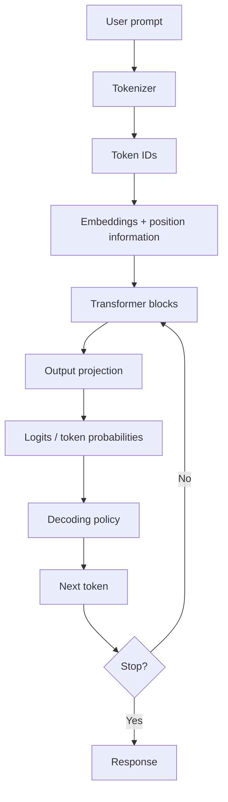
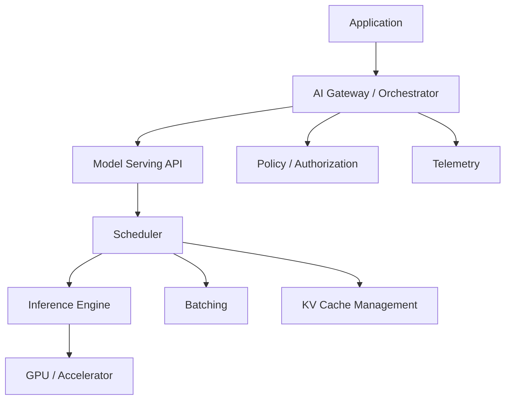
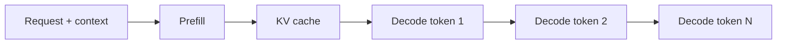
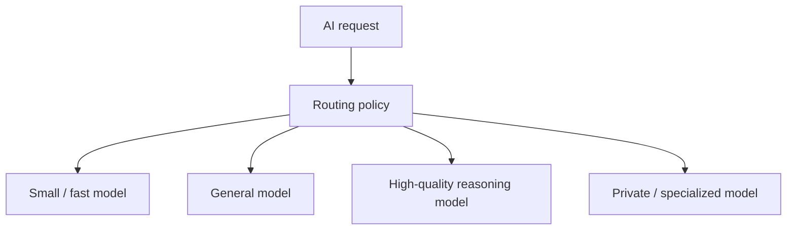

# Chapter 3 Diagrams

## Transformer Inference Flow

```mermaid
flowchart TD
    A[User prompt] --> B[Tokenizer]
    B --> C[Token IDs]
    C --> D[Embeddings + position information]
    D --> E[Transformer blocks]
    E --> F[Output projection]
    F --> G[Logits / token probabilities]
    G --> H[Decoding policy]
    H --> I[Next token]
    I --> J{Stop?}
    J -- No --> E
    J -- Yes --> K[Response]
```

## Production Inference Stack

```mermaid
flowchart TD
    A[Application] --> B[AI Gateway / Orchestrator]
    B --> C[Model Serving API]
    C --> D[Scheduler]
    D --> E[Inference Engine]
    E --> F[GPU / Accelerator]
    D --> G[Batching]
    D --> H[KV Cache Management]
    B --> I[Policy / Authorization]
    B --> J[Telemetry]
```

## Prefill and Decode

```mermaid
flowchart LR
    A[Request + context] --> B[Prefill]
    B --> C[KV cache]
    C --> D[Decode token 1]
    D --> E[Decode token 2]
    E --> F[Decode token N]
```

## Model Routing

```mermaid
flowchart TD
    A[AI request] --> B[Routing policy]
    B --> C[Small / fast model]
    B --> D[General model]
    B --> E[High-quality reasoning model]
    B --> F[Private / specialized model]
```
